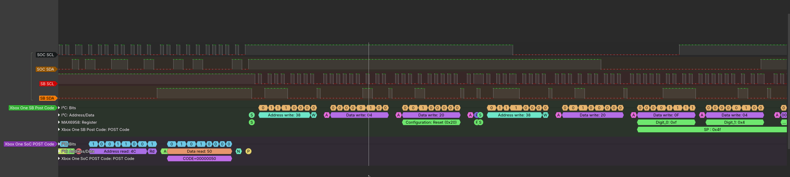
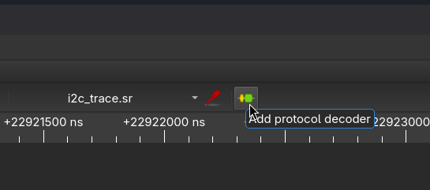
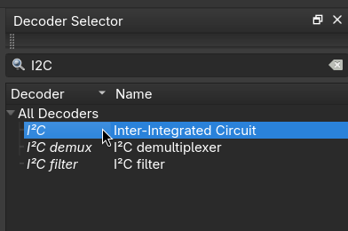
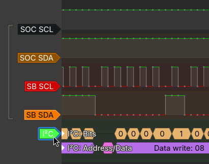
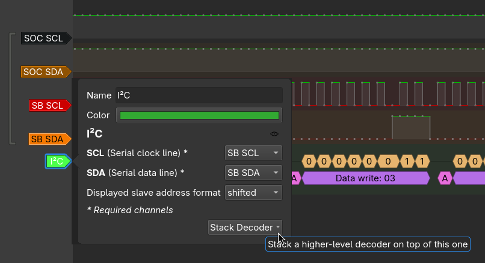
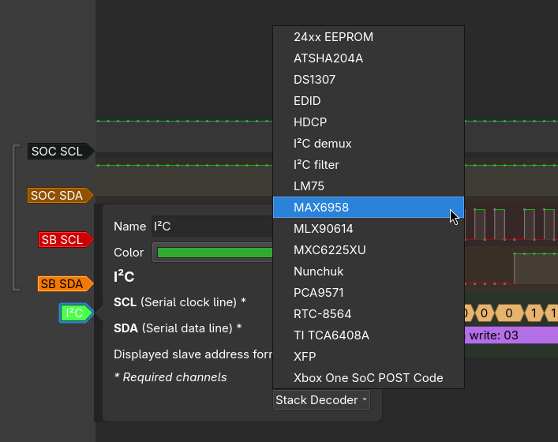
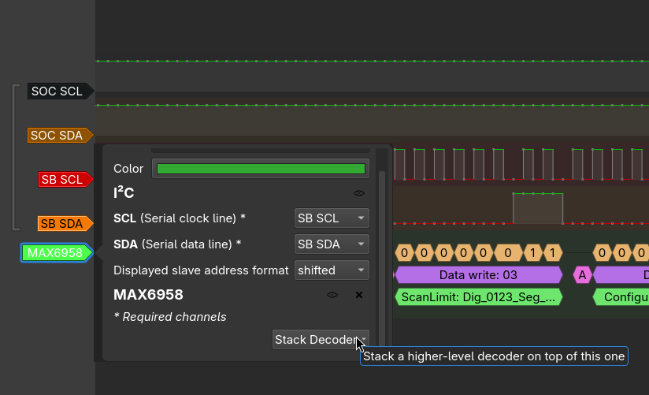
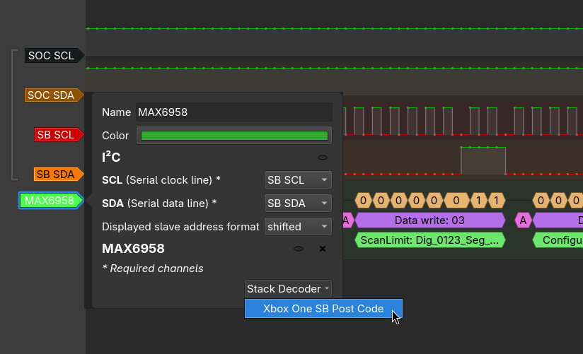
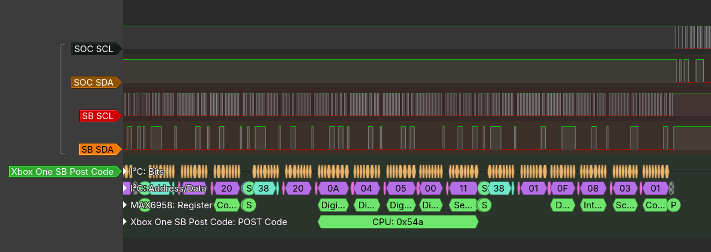

# Xbox One I2C Protocol Decoders (Sigrok / Pulseview)

Decode Xbox One I2C traffic of SMBUS2/3 busses, to easily see POST codes in your logic analyzer traces.

## Example output

### Command line via sigrok-cli

```
shell> sigrok-cli -i i2c_trace.sr -P "i2c:sda=SB SDA:scl=SB SCL,max6958,xbox_one_sb_post" -P "i2c:sda=SOC SDA:scl=SOC SCL,xbox_one_soc_post" -A "xbox_one_soc_post,xbox_one_sb_post"
xbox_one_sb_post-1: SP : 0x42
xbox_one_sb_post-1: SP : 0x43
xbox_one_sb_post-1: SP : 0x44
xbox_one_sb_post-1: SP : 0x45
xbox_one_sb_post-1: SP : 0x4b
xbox_one_sb_post-1: SP : 0x4c
xbox_one_sb_post-1: SP : 0x50
xbox_one_sb_post-1: SP : 0x53
xbox_one_sb_post-1: CPU: 0x100
xbox_one_sb_post-1: SP : 0x5c
xbox_one_sb_post-1: CPU: 0x101
xbox_one_sb_post-1: CPU: 0x102
xbox_one_sb_post-1: CPU: 0x103
xbox_one_soc_post-1: CODE=00000042
xbox_one_soc_post-1: CODE=00000042
xbox_one_soc_post-1: CODE=00000043
xbox_one_soc_post-1: CODE=00000044
```

### PulseView GUI



## Quick Start

### Deploy on Linux

1. **Locate the sigrok decoders directory:**
   ```bash
   sigrok-cli --version  # Find libsigrokdecode path
   # Usually: ~/.local/share/libsigrokdecode/decoders/ or /usr/share/libsigrokdecode/decoders/
   ```

2. **Create decoder directory:**
   ```bash
   mkdir -p ~/.local/share/libsigrokdecode/decoders/{max6958,xbox_one_sb_post,xbox_one_soc_post}
   ```

3. **Copy decoder files:**
   ```bash
   cp max6958/* ~/.local/share/libsigrokdecode/decoders/max6958/
   cp xbox_one_sb_post/* ~/.local/share/libsigrokdecode/decoders/xbox_one_sb_post/
   cp xbox_one_soc_post/* ~/.local/share/libsigrokdecode/decoders/xbox_one_soc_post/
   ```

4. **Verify installation:**
   ```bash
   sigrok-cli -L | grep -E 'xbox_one_sb_post|xbox_one_soc_post|max6958'
   ```

## Usage

- Create / load a capture file in PulseView

- Add protocol decoder(s)



- Choose **I2C** as the base decoder



- Click on the added decoder label



- Assign the correct channels for SCL/SDA, then hit **Stack Decoder**.

**NOTE**: You can also name your decoder accordingly.



- Choose the sub-decoder(s)

For Xbox One SMBUS2 (SB), stack:
  - **MAX6958**
  - **Xbox One SB POST Code**

For Xbox One SMBUS3 (SoC), stack:
  - **Xbox One SoC POST Code**


The following pictures show the flow for **SMBUS2**
  








## Development tips

- Ensure decoders are python3.4 compliant, sigrok/pulseview windows builds are bundled with that version of python!
- ...
